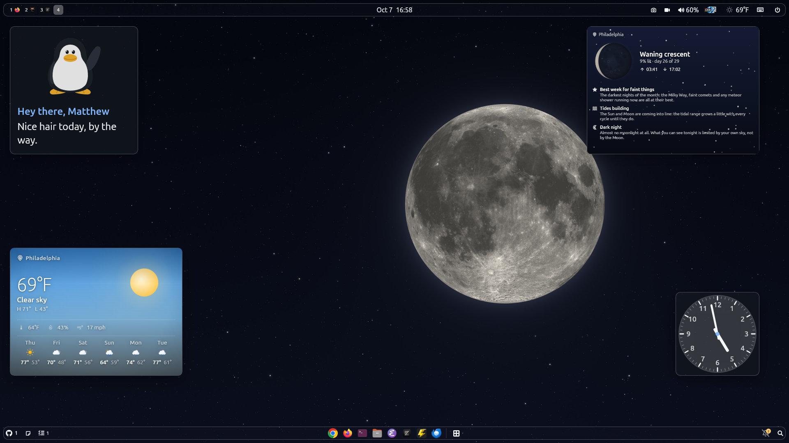

# Graceful

The shell of your dreams, built with Flutter.



## Dependencies

Install the required system libraries before building:

- `libgtk3`
- `gtk-layer-shell`
- `libasound2-dev`
- `libmpv-dev`

On Ubuntu 26.04:

```sh
sudo apt install libgtk-3-dev libgtk-layer-shell-dev libasound2-dev libmpv-dev
```

You also need the [Flutter SDK](https://docs.flutter.dev/get-started/install/linux) on the `master` channel:

```sh
flutter channel master
flutter upgrade
```

## Install the nightly snap (amd64)

Prebuilt classic snaps are published for every commit to `main`. Download the
latest `graceful-shell_*.snap` from the [nightly release](https://github.com/miracle-wm-org/graceful-shell/releases/tag/nightly),
then install it:

```sh
sudo snap install ./graceful-shell_*.snap --classic --dangerous
```

`--classic` is required (this shell needs full access to the Wayland compositor);
`--dangerous` allows installing a locally downloaded snap. Once installed, run:

```sh
graceful-shell
```

To update, download the newest snap and re-run the install command. To remove:

```sh
sudo snap remove graceful-shell
```

## Building and installing

Enable Flutter's experimental windowing API (one-time setup):

```sh
flutter config --enable-windowing
```

Build and install to `~/.local` (default):

```sh
make install
```

Or install to a custom prefix:

```sh
make install PREFIX=/usr/local
```

This copies the binary, libraries, and the default wallpaper to the prefix. Make sure `$PREFIX/bin` is in your `PATH`.

Once built, simply run:

```sh
graceful-shell
```

To uninstall:

```sh
make uninstall
```

## Running in development

```sh
flutter run -d linux
```
